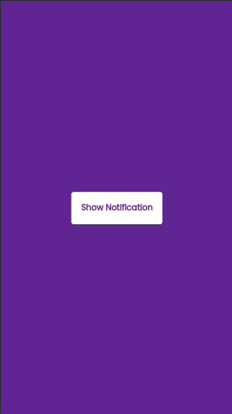

<h1 align="center">
   JavaScriptToastNotification
</h1>

  

- This is a simple project made using JavaScript to show some notifications on webpages. 
- It can be used to make your application still better. 
- When the button is clicked, the notifications is showed for 3 seconds.

Classes here

<a href="https://www.udemy.com/course/50-projects-50-days/">50 Projects In 50 Days - HTML, CSS & JavaScript
</a>

